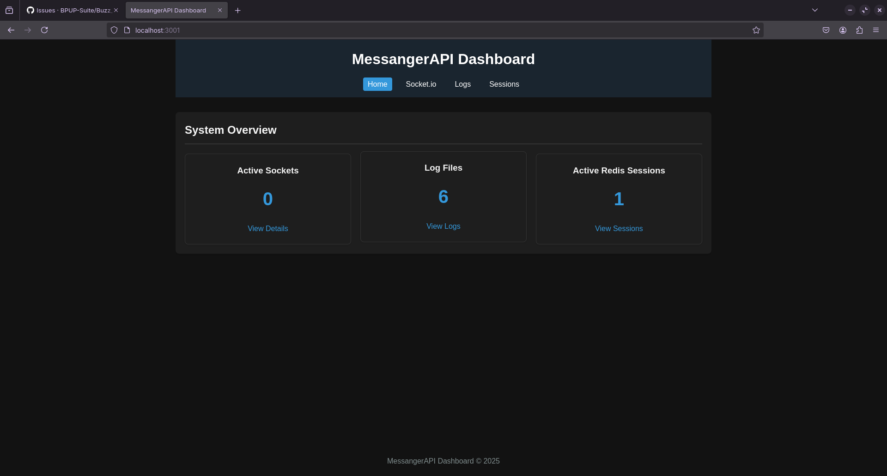
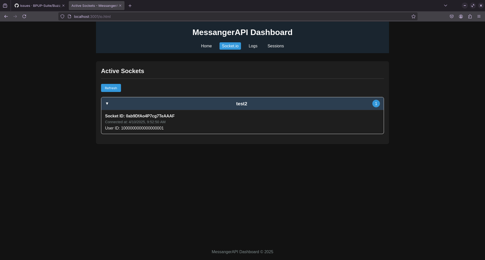
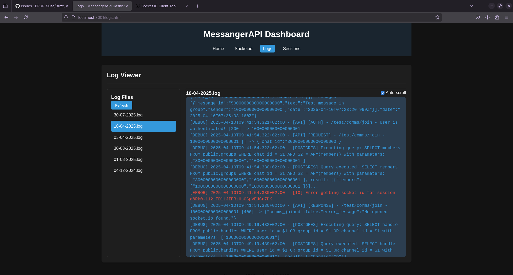
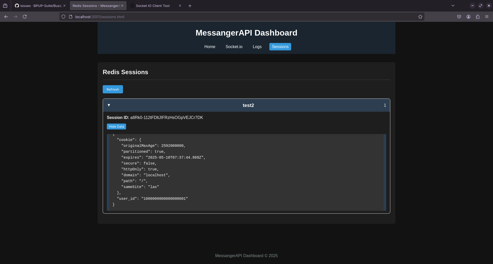

# ⋆˚🐝˖°﹒Messanger_API (Buzz API per gli amici)

API per l`app di messaggistica

Se vuoi usarla ti basta clonare la repo, cambiare il nome a example.env in .env, cambiarne i valori e utilizzare docker-compose per inizializzare il tutto

*Configurazione di Nginx Proxy Manager* ??? ve la dò un giorno (anche perchè uso la versione web decisamente più facile da gestire, finirò probabilmente per mettere una semplice guida alla configurazione piuttosto che i file veri e propri)

##

- [To-dos](#To-dos)
- [Documentation](#Documentation)
    - [Docker](#Docker)
    - [Environmentals](#Environmental)
    - [Databases](#Databases)
    - [API](#API)
    - [Socket.io](#Socket.io)
    - [Dashboard](#Dashboard)
      - [Screenshots](#Screenshots)
    - [Dictionary](#Dictionary)
      - [Tags](#Tags)
      - [Variables](#Variables)
      - [Errors](#Errors)
        - [Codes](#Codes)
        - [Messages](#Messages)

     
## To-dos

- [x] Aggiungi dizionario per errori
- [x] Provare le checklist
- [ ] Completare la nuova documentazione
- [ ] Da aggiornare la vecchia descrizione subito qui sopra
- [ ] Fornire la guida/documentazione a nginx
- [ ] Database rework
- [x] Tutti i metodi devono avere - al posto di _, mentre tutte le risposte avranno _ nelle variabili

# Documentation

## Docker

WARNING: Prometheus e Grafana sono in fase di testing e attualmente non è stato deciso nessun modo per garantire la sicurezza delle metriche, esattamente come la dashboard personalizzata e la documentazione dell'api. 

_docker-compose.yml:_
```

services:
  postgres:
    image: postgres
    container_name: ${POSTGRES_HOST}
    restart: always
    env_file:
      - .env
    volumes:
      - ./data/postgresql:/var/lib/postgresql/data
      - ./postgresql:/docker-entrypoint-initdb.d 
    healthcheck:
      test: ["CMD-SHELL", "pg_isready","-d","${POSTGRES_DB}","-h","db","-U","${POSTGRES_USER}"]
      interval: 10s
      timeout: 5s
      retries: 5

  server:
    build:
      context: .
      dockerfile: ./docker/Dockerfile
    ports:
      - ${DASHBOARD_PORT}:${DASHBOARD_PORT}    # admin dashboard
      - ${API_PORT}:${API_PORT}                # api
      - ${IO_PORT}:${IO_PORT}                  # socket.io
    env_file:
      - .env
    volumes:
      - ./data/server/logs:${LOGS_FOLDER_PATH}
      - ./data/server/security:${SECURITY_FOLDER_PATH}
    restart: unless-stopped
    depends_on:
      postgres:
        condition: service_healthy
      redis:
        condition: service_healthy

  redis:
    image: redis:latest
    container_name: ${REDIS_HOST}
    volumes:
      - ./data/redis:/data
    restart: unless-stopped
    healthcheck:
      test: ["CMD", "redis-cli", "ping"]
      interval: 10s
      timeout: 5s
      retries: 5

  prometheus:
      ports:
          - ${PROMETHEUS_PORT}:9090
      volumes:
          - ./metrics/prometheus/config.yml:/etc/prometheus/prometheus.yml
      image: prom/prometheus:latest
      healthcheck:
        test: ["CMD", "wget", "--spider", "http://localhost:9090/-/healthy"]
        interval: 10s
        timeout: 5s
        retries: 5
      restart: unless-stopped


  grafana:
      ports:
          - ${GRAFANA_PORT}:3000
      environment:
          - GF_AUTH_DISABLE_LOGIN_FORM=true
          - GF_AUTH_ANONYMOUS_ENABLED=true
          - GF_AUTH_ANONYMOUS_ORG_ROLE=Admin
      volumes:
          - ./metrics/grafana/config.yml:/etc/grafana/provisioning/datasources/datasources.yml
          - ./metrics/grafana/provisioning/dashboards:/etc/grafana/provisioning/dashboards
          - ./metrics/grafana/dashboards:/var/lib/grafana/dashboards
      image: grafana/grafana:latest
      depends_on:
          prometheus:
              condition: service_healthy
      restart: unless-stopped

```

## Environmental

Ogni campo con tag (# needed) è fondamentale per l'avvio e il funzionamento dell'applicazione. In caso contrario sarà richiesto nei log di inserire i valori e il server non partirà. Al contrario, se non è necessario allora verrà assegnato un valore di default in caso di sua assenza (questo NON è valido nel caso in cui il valore venga utilizzato nel docker-compose.yml, in quel caso darà errore all'inizializzazione dei container, questo riguarda tutte le porte e i path alle folder nell'api)

_.env:_
```
NODE_ENV = production                          # | default=production
DOMAIN = buzz.it                               #   needed 
VERSION=v1                                     # | default=v1 (or 'test' in development mode)
SERVER_HOST=buzz_server                        #   needed
POSTGRES_DB = postgres                         # | default=postgres
POSTGRES_USER = buzz                           #   needed
POSTGRES_PASSWORD = password                   #   needed
POSTGRES_HOST = local_postgres                 # | default=local_postgres
POSTGRES_PORT = 5432                           # | default=5432
REDIS_HOST = local_redis                       # | default=local_redis
REDIS_PORT = 6379                              # | default=6379
SERVER_IP=0.0.0.0                              # | default=0.0.0.0
API_PORT=8000                                  # | default=8000
IO_PORT=8001                                   # | default=8001
PROMETHEUS_PORT=9090                           # | not used in nodejs
GRAFANA_PORT=3001                              # | not used in nodejs
DASHBOARD_PORT=3000                            # | default=3000
LOGS_FOLDER_PATH=/logs                         # | default=/logs
SECURITY_FOLDER_PATH=/security                 # | default=/security
DEBUG_MODE=true                                # | default=false (or true in development mode)
TIMEZONE=Europe/Rome                           # | default=Europe/Rome
RATE_LIMITER_NUMBER=100                        # | default=100
RATE_LIMITER_MILLISECONDS=10000                # | default=10000
MAX_SESSION_PER_USER=10                        # | default=10
```

NODE_ENV -> (if not on production will not use DOMAIN and will be only HTTP, es: 'developement')

DOMAIN -> (using buzz.it as an example we will have api.buzz.it for API and io.buzz.it for SOCKET.IO and cookie will be stored in api.buzz.it)

## Databases

  - [Postgres](#Postgres)
  - [Redis](#Redis)

### Postgres

Questo file verrà a breve cambiato per iniziare il rework totale della sezione database, quindi per ora rimane qua il db che usiamo attualmente, dopo tirerò fuori quelo sottosteroidi nuovo

_init.sql:_
```
-- 1000000000000000000 // user
-- 2000000000000000000 // chat
-- 3000000000000000000 // group
-- 4000000000000000000 // channel
-- 5000000000000000000 // message
-- 6000000000000000000 // files

--
-- PostgreSQL database dump
--

-- Dumped from database version 16.4 (Debian 16.4-1.pgdg120+1)
-- Dumped by pg_dump version 16.4 (Debian 16.4-1.pgdg120+1)

SET statement_timeout = 0;
SET lock_timeout = 0;
SET idle_in_transaction_session_timeout = 0;
SET client_encoding = 'UTF8';
SET standard_conforming_strings = on;
SELECT pg_catalog.set_config('search_path', '', false);
SET check_function_bodies = false;
SET xmloption = content;
SET client_min_messages = warning;
SET row_security = off;

SET default_tablespace = '';

SET default_table_access_method = heap;

CREATE EXTENSION IF NOT EXISTS pg_trgm;
CREATE ROLE root WITH LOGIN SUPERUSER PASSWORD 'root';
CREATE DATABASE root;

--
-- Name: channels; Type: TABLE; Schema: public; Owner: bpup
--

CREATE TABLE public.channels (
    chat_id bigint NOT NULL,
    name text NOT NULL,
    pinned_messages text[],
    members bigint[] NOT NULL,
    admins bigint[] NOT NULL,
    description text,
    group_picture_id bigint[],
    theme text
);

ALTER TABLE public.channels ADD CONSTRAINT channels_pkey PRIMARY KEY (chat_id);
ALTER TABLE public.channels OWNER TO bpup;

--
-- Name: chats; Type: TABLE; Schema: public; Owner: bpup
--

CREATE TABLE public.chats (
    chat_id bigint NOT NULL GENERATED ALWAYS AS IDENTITY ( INCREMENT 1 START 2000000000000000000 MINVALUE 2000000000000000000 MAXVALUE 2999999999999999999 CACHE 1 ),
    user1 bigint NOT NULL,
    user2 bigint NOT NULL,
    pinned_messages text[]
);

ALTER TABLE public.chats ADD CONSTRAINT chats_pkey PRIMARY KEY (chat_id);
ALTER TABLE public.chats OWNER TO bpup;

--
-- Name: files; Type: TABLE; Schema: public; Owner: bpup
--

CREATE TABLE public.files (
    files_id bigint NOT NULL,
    file_path text NOT NULL
);

ALTER TABLE public.files ADD CONSTRAINT files_pkey PRIMARY KEY (files_id);
ALTER TABLE public.files OWNER TO bpup;

--
-- Name: groups; Type: TABLE; Schema: public; Owner: bpup
--

CREATE TABLE public.groups (
    chat_id bigint NOT NULL,
    name text NOT NULL,
    pinned_messages text[],
    members bigint[] NOT NULL,
    admins bigint[] NOT NULL,
    description text,
    group_picture_id bigint[]
);

ALTER TABLE public.groups ADD CONSTRAINT groups_pkey PRIMARY KEY (chat_id);
ALTER TABLE public.groups OWNER TO bpup;

--
-- Name: handles; Type: TABLE; Schema: public; Owner: bpup
--

CREATE TABLE public.handles (
    user_id bigint,
    group_id bigint,
    channel_id bigint,
    handle text NOT NULL
);

ALTER TABLE public.handles ADD CONSTRAINT handles_pkey PRIMARY KEY (handle);
ALTER TABLE public.handles OWNER TO bpup;

--
-- Name: messages; Type: TABLE; Schema: public; Owner: bpup
--

CREATE TABLE public.messages (
    message_id bigint NOT NULL GENERATED ALWAYS AS IDENTITY ( INCREMENT 1 START 5000000000000000000 MINVALUE 5000000000000000000 MAXVALUE 5999999999999999999 CACHE 1 ),
    chat_id bigint NOT NULL,
    text text NOT NULL,
    sender bigint NOT NULL,
    date timestamp without time zone NOT NULL,
    -- modified boolean DEFAULT FALSE,
    -- conferme di lettura array persone
    forward_message_id bigint,
    file_id bigint,
    file_type text
);


ALTER TABLE public.messages ADD CONSTRAINT messages_pkey PRIMARY KEY (message_id,chat_id);
ALTER TABLE public.messages OWNER TO bpup;


--
-- Name: users; Type: TABLE; Schema: public; Owner: bpup
--

CREATE TABLE public.users (
    user_id bigint NOT NULL GENERATED ALWAYS AS IDENTITY ( INCREMENT 1 START 1000000000000000000 MINVALUE 1000000000000000000 MAXVALUE 1999999999999999999 CACHE 1 ),
    email text NOT NULL,
    name text NOT NULL,
    surname text NOT NULL,
    password text NOT NULL,
    description text,
    profile_picture_id bigint[],
    phone_number text,
    birthday date,
    theme text,
    last_access timestamp without time zone
);

ALTER TABLE public.users ADD CONSTRAINT users_pkey PRIMARY KEY (user_id);
ALTER TABLE public.users OWNER TO bpup;

```

### Redis
 _REDACTED_


## API

- [user/](#user/)
- [chat/](#chat/)

La seguente documentazione è ordinata il modo tale da costruire il path a ogni richiesta tramite i vari titoli inoltre verranno forniti i percorsi per accedere al metodo, i parametri da passare e le possibili risposte.

Tutte le risposte sono SEMPRE in formato JSON.

Negli esempi forniti le risposte NON comprendono i casi dove sono presenti errori, vengono presi in considerazione solo casistiche con richiesta ricevuta, elaborata con successo e risposta inviata.

Tutti i metodi sono dentro il path v1/ per permettere in futuro un cambiamento drastico ai metodi dell'api senza intaccare la funzionalità delle vecchie applicazioni.

Tutti i metodi sono disponibili sia per richieste GET (acquisizione dei parametri dalla query) sia per richieste POST (acquisizione dei parametri dal body in x-www-form-urlencoded). 

Se il metodo presenta il tag [Input](#Input) avrà dei parametri in input da passare (o da query o da body) sarà necessario verificare la loro validità altrimenti verrà tornato un errore [400](#400) con relativo messaggio che spiega esattamente quale parametro ha problema di sintassi (nella documentazione dell'errore sarà specificato i parametri con cui verrà valutata la validità di un parametro).

Se il metodo presenta il tag [Output](#Output) avrà dei parametri in output utili a delle elaborazioni lato client. (Le conferme di azioni (es. ```{logged_in:true}```) non vengono contati come [Output](#Output) in quanto NON necessari al funzionamento del client, per verificare se una richiesta ha avuto successo basta controllare il codice della risposta (es. [200](#200))).

Se il metodo presenta il tag [Authentication](#authentication) sarà necessario fare prima il login per accedere al metodo, in caso contario verrà tornato un errore [401](#401) e il messaggio [Non Authorized](#Non%20Authorized).

Se il metodo ritorna errore [500](#500) con messaggio [Generic Error](#Generic%20Error) è molto probabile che si sia verificato un errore lato server. È quindi necessario contattare l'admin del server o aprire un issue in questa repository per trovare e risolvere il problema.

Se il metodo ritorna un qualsiasi tipo di [Errors](#Errors) code allora sarà associato ad un ```{error_message: «Message»}```. È consigliato leggere questo errore per capire la tipologia specifica del problema. (es. ```{error_message: "Handle not valid"}```)

Se il metodo ritorna risposta [200](#200) il tutto è andato a buon fine e sono stati ritornati dei parametri che indi  cano lo stato della richiesta (es. ```{logged_in:true}```) e, dove viene richiesto, i parametri di risposta.

### user/

- [auth/](#auth/)
- [data/](#data/)

#### auth/

- [access](#access)
- [signup](#signup)
- [login](#login)
- [logout](#logout)

##### access

Tells the client if a specific e-mail is already registered.

Path : ```{URL}/v1/user/auth/access```

- [Input](#Input):

  - [email](#email)

- [Output](#Output):

  - [access_type](#access_type)

Example:
```
Request: {URL}/v1/user/auth/access?email=test@gmail.com

Response: 

{
  access_type: signup
}

OR

{
  access_type: login
}

```

##### signup

Adds a user to database

Path : ```{URL}/v1/user/auth/signup```

- [Input](#Input):

  - [name](#name)
  - [surname](#surname)
  - [handle](#handle)
  - [email](#email)
  - [password](#password)


Example:
```
Request: {URL}/v1/user/auth/signup?name=test&surname=test&handle=test&email=test@gmail.com&password=Test1234!

Response: 

{
  signed_up: true
}

```

##### login

Let users access their account

Path : ```{URL}/v1/user/auth/login```

- [Input](#Input):

  - [email](#email)
  - [password](#password)

- [Output](#Output):

  - [token](#token)

Example:
```
Request: {URL}/v1/user/auth/login?email=test@gmail.com&password=Test1234!

Response: 

{
  logged_in: true,
  token: "aNF9pCG8OWpiwXgCDKfh4gTyO7ZB7CsV"
}

```

##### logout

Delete active session and disconnect current connected socket.

Path : ```{URL}/v1/user/auth/logout```

- [Authentication](#Authentication)

Example:
```
Request: {URL}/v1/user/auth/logout

Response: 

{
  logged_out: true
}

```

##### session (DEPRECATED)

Returns session id value

Path : ```{URL}/v1/user/auth/session```

- [Output](#Output):

  - [session_id](#session_id)

- [Authentication](#Authentication)

Example:
```
Request: {URL}/v1/user/auth/session

Response: 

{
  session_id: "aNF9pCG8OWpiwXgCDKfh4gTyO7ZB7CsV"
}

```

### data/

- [check/](#check/)
- [get/](#get)
- [search/](#search/)

#### check/

- [handle-availability](#handle-availability)

##### handle-availability

Returns the state of availability for handles

Path : ```{URL}/v1/user/data/check/handle-availability```

- [Input](#Input):

  - [handle](#handle)


Example:
```
Request: {URL}/v1/user/data/check/handle-availability?handle=test

Response: 

{
  handle_available:true
}

OR 

{
  handle_available: false
}

```

#### get/

- [init](#init)
- [update](#update)

##### init

Returns ALL informations about the requesting user

Path : ```{URL}/v1/user/data/get/init```

- [Authentication](#Authentication)

- [Output](#Output):
  - localUser:
      - [email](#email)
      - [user_id](#user_id)
      - [name](#name)
      - [surname](#surname)
      - [handle](#handle)
  - chats:
    - [chat_id](#chat_id)
    - messages:
      - [message_id](#message_id)
      - [text](#text)
      - [sender](#sender)
      - [date](#date)
  - groups:
    - [chat_id](#chat_id)
    - [name](#name)
    - [users](#users)
    - messages:
      - [message_id](#message_id)
      - [text](#text)
      - [sender](#sender)
      - [date](#date)

  Where localUser contains user parameters, chats contains a list of chat and messages contains a list of message.

Example:
```
Request: {URL}/v1/user/data/get/init

Response: 

{
    "init": true,
    "localUser": {
        "handle": "test",
        "email": "test@gmail.com",
        "name": "test",
        "surname": "test",
        "user_id": "1000000000000000000"
    },
    "chats": [
        {
            "chat_id": "2000000000000000000",
            "users": [
                {
                    "handle": "test"
                },
                {
                    "handle": "test1"
                }
            ],
            "messages": [
                {
                    "message_id": "5000000000000000000",
                    "text": "Ciaooo come stai",
                    "sender": "1000000000000000000",
                    "date": "2025-03-10T17:07:41.058Z"
                },
                {
                    "message_id": "5000000000000000001",
                    "text": "Ciaooo come stai",
                    "sender": "1000000000000000001",
                    "date": "2025-03-10T17:08:20.364Z"
                }
            ]
        },
        {
            "chat_id": "2000000000000000001",
            "users": [
                {
                    "handle": "test"
                },
                {
                    "handle": "test2"
                }
            ],
            "messages": [
                {
                    "message_id": "5000000000000000000",
                    "text": "Ehy son io",
                    "sender": "1000000000000000000",
                    "date": "2025-04-10T19:09:19.123Z"
                },
                {
                    "message_id": "5000000000000000001",
                    "text": "Ehy ciao io",
                    "sender": "1000000000000000002",
                    "date": "2025-04-10T19:09:21.453Z"
                }
            ]
        }
    ],
    "groups": [
      {
        "name": "test_group",
        "chat_id": "3000000000000000000",
        "users": [
          {
            "user_id": "1000000000000000000",
            "handle": "test"
          }
        ],
        "messages": [
          {
            "message_id": "5000000000000000000",
            "text": "Test message in group",
            "sender": "1000000000000000000",
            "date": "2025-04-10T07:23:20.999Z"
          }
        ]
      }
    ]
}

```

##### update

Retrieve updates since a specified datetime.

Path : `{URL}/v1/user/data/get/update`

- [Input](#Input):

  - [latest_update_datetime](#latest_update_datetime)

- [Output](#Output):

  - chats:
    - [chat_id](#chat_id)
    - messages:
      - [message_id](#message_id)
      - [text](#text)
      - [sender](#sender)
      - [date](#date)
  - groups:
    - [chat_id](#chat_id)
    - [name](#name)
    - [users](#users)
    - messages:
      - [message_id](#message_id)
      - [text](#text)
      - [sender](#sender)
      - [date](#date)

- [Authentication](#Authentication)

Example:
```
Request: {URL}/v1/user/data/get/update?latest_update_datetime=2025-04-10T07:21:20.999Z

Response: 

{
  "update": true,
  "date": "2025-04-10T07:26:21.265Z",
    "chats": [
        {
            "chat_id": "2000000000000000000",
            "users": [
                {
                    "handle": "test"
                },
                {
                    "handle": "test1"
                }
            ],
            "messages": [
                {
                    "message_id": "5000000000000000000",
                    "text": "Ciaooo come stai",
                    "sender": "1000000000000000000",
                    "date": "2025-04-10T07:25:21.265Z"
                },
                {
                    "message_id": "5000000000000000001",
                    "text": "Ciaooo come stai",
                    "sender": "1000000000000000001",
                    "date": "2025-04-10T07:25:21.265Z"
                }
            ]
        },
        {
            "chat_id": "2000000000000000001",
            "users": [
                {
                    "handle": "test"
                },
                {
                    "handle": "test2"
                }
            ],
            "messages": [
                {
                    "message_id": "5000000000000000000",
                    "text": "Ehy son io",
                    "sender": "1000000000000000000",
                    "date": "2025-04-10T07:25:21.265Z"
                },
                {
                    "message_id": "5000000000000000001",
                    "text": "Ehy ciao io",
                    "sender": "1000000000000000002",
                    "date": "2025-04-10T07:25:21.265Z"
                }
            ]
        }
    ],
  "groups": [
    {
      "name": "test_group",
      "chat_id": "3000000000000000000",
      "description": "",
      "users": [
        {
          "user_id": "1000000000000000000",
          "handle": "test"
        }
      ],
      "messages": [
        {
          "message_id": "5000000000000000000",
          "text": "Test message in group",
          "sender": "1000000000000000000",
          "date": "2025-04-10T07:23:20.999Z"
        }
      ]
    }
  ]
}
```

#### search/

- [all](#all)
- [users](#users)

##### all

Path : `{URL}/v1/user/data/search/all`

- [Input](#Input):

  - [handle](#handle)

- [Output](#Output):

  - [handle](#handle)
  - [type](#type)

Example:
```
Request: {URL}/v1/user/data/search/all?handle=test

Response: 

[
  {
    "handle": "test",
    "type": "user"
  },
  {
    "handle": "test_group",
    "type": "group"
  }
]
```

##### users

Path : `{URL}/v1/user/data/search/users`

- [Input](#Input):

  - [handle](#handle)

- [Output](#Output):

  - [handle](#handle)

Example:
```
Request: {URL}/v1/user/data/search/users?handle=test

Response: 

[
  {
    "handle": "test_user1"
  },
  {
    "handle": "test_user2"
  }
]
```

### chat/

- [send/](#send/)
- [create/](#create/)

#### send/

- [message](#message)
- [voice-message](#voice-message)
- [file](#file)

##### message

Path : `{URL}/v1/chat/send/message`

- [Input](#Input):

  - [chat_id](#chat_id)
  - [text](#text)

- [Output](#Output):

  - [chat_id](#chat_id)
  - [message_id](#message_id)
  - [sender](#sender)
  - [text](#text)
  - [date](#date)

Example:
```
Request: {URL}/v1/chat/send/message?text=Test%20message%20in%20group&chat_id=3000000000000000000

Response:   

{
  "message_sent": true,
  "chat_id": "3000000000000000000",
  "message_id": "5000000000000000000",
  "sender": "1000000000000000000",
  "text": "Test message in group",
  "date": "2025-04-10T07:23:20.999Z"
}
```

##### voice-message

None

##### file

None

#### create/

- [chat](#chat)
- [group](#group)
- [channel](#channel)

##### chat

Path : `{URL}/v1/chat/create/chat`

- [Input](#Input):

  - [handle](#handle)

- [Output](#Output):

  - [chat_id](#chat_id)

Example:
```
Request: {URL}/v1/chat/create/chat?handle=test

Response: 

{
  "chat_created": true,
  "chat_id": "2000000000000000000"
}
```

##### group

Path : `{URL}/v1/chat/create/group`

- [Input](#Input):

  - [name](#name) 
  - [handle](#handle)   # NOT required, only if you need a public group

- [Output](#Output):

  - [chat_id](#chat_id)

Example:
```
Request: {URL}/v1/chat/create/group?name=test_group&handle=test_group

Response: 

{
  "group_created": true,
  "chat_id": "3000000000000000000"
}
```

##### channel

None

#### join/


##### group

Path : `{URL}/v1/chat/join/group`

Used to join a PUBLIC group and return ALL info about that specific group

- [Input](#Input):

  - [handle](#handle)

- [Output](#Output):

  - [chat_id](#chat_id)
  - [name](#name)
  - [members](#users)
  - messages:
    - [message_id](#message_id)
    - [text](#text)
    - [sender](#sender)
    - [date](#date)

Example:
```
Request: {URL}/v1/chat/join/group?handle=test_group

Response: 

{
  "group_joined": true,
  "group_name": "test_group",
  "chat_id": "3000000000000000000",
  "members": [
    {
      "user_id": "1000000000000000000",
      "handle": "test"
    },
    {
      "user_id": "1000000000000000001",
      "handle": "test2"
    }
  ],
  "messages": [
    {
      "message_id": "5000000000000000000",
      "text": "Test message in group",
      "sender": "1000000000000000000",
      "date": "2025-04-10T07:23:20.999Z"
    }
  ]
}
```

##### channel

None

### comms/

  - [join](#join)
  - [leave](#leave)

#### join

Join a voice/video chat. A Socket needs to be open in order to use this method.

Path : `{URL}/v1/chat/join/comms`

- [Input](#Input):

  - [chat_id](#chat_id)

Example:
```
Request: {URL}/v1/chat/join/comms?chat_id=3000000000000000000

Response: 

{
  "comms_joined": true
}
```

#### leave

Leave a voice/video chat. A Socket needs to be open in order to use this method.

Path : `{URL}/v1/chat/leave/comms`

- [Output](#Output):

  - [chat_id](#chat_id)

Example:
```
Request: {URL}/v1/chat/leave/comms

Response: 

{
  "comms_left": true,
  "chat_id": 3000000000000000000
}
```

## Socket.io

### Authentication

Socket.io requires authentication using a session ID. The session ID must be provided during the handshake process. If the session ID is invalid or missing, the connection will be rejected.

Only ONE connection is allowed for every [session_id](#session_id).

Example:
```
{
  "auth": {
    "sessionId": "aNF9pLg8OWpIwXgCDKfh4gtYO7ZB7CsV"
  }
}
```

Base events like connection and disconnect are excluded.

  Events list:
    Emitted:
    - [receive_message](#receive_message)
    - [group_created](#group_created)
    - [group_member_joined](#group_member_joined)
    - [member_joined_group](#member_joined_group)
    - [member_left_comms](#member_left_comms)
    - [candidate](#candidate)
    Received:
      - [candidate](#candidate)


### receive_message

Receives messages sent by other users or other active sockets of the same user.

- **Output**:
  ```json
  {
    "type": "receive_message",
    "message_id": "5000000000000000000",
    "chat_id": "3000000000000000000",
    "text": "Hello!",
    "sender": "1000000000000000000",
    "date": "2025-04-10T07:23:20.999Z"
  }
  ```

---

### group_created

Notifies all members of a group that a new group has been created.

- **Output**:
  ```json
  {
    "type": "group_created",
    "chat_id": "3000000000000000000",
    "name": "test_group",
    "description": "Group description",
    "members": ["1000000000000000000", "1000000000000000001"],
    "admins": ["1000000000000000000"],
    "date": "2025-04-10T07:23:20.999Z"
  }
  ```

---

### group_member_joined

Notifies all members of a group that a new member has joined.

- **Output**:
  ```json
  {
    "type": "group_member_joined",
    "chat_id": "3000000000000000000",
    "new_member": {
      "user_id": "1000000000000000002",
      "handle": "new_user"
    }
  }
  ```

---

### member_joined_group

Notifies the new member that they have joined a group.

- **Output**:
  ```json
  {
    "type": "member_joined_group",
    "chat_id": "3000000000000000000",
    "name": "test_group",
    "description": "Group description",
    "members": ["1000000000000000000", "1000000000000000001"],
    "admins": ["1000000000000000000"],
    "date": "2025-04-10T07:23:20.999Z"
  }
  ```

---

### member_left_comms

Notifies all members of a communication room that a member has left.

- **Output**:
  ```json
  {
    "type": "member_left_comms",
    "chat_id": "3000000000000000000",
    "user_id": "1000000000000000000"
  }
  ```

---

### candidate

Used for WebRTC signaling to send ICE candidates.

- **Input**:
  ```json
  {
    "type": "candidate",
    "to": "3000000000000000000",
    "candidate": { "candidate": "candidate-data" }
  }
  ```

- **Output**:
  Sent to the specified room:
  ```json
  {
    "type": "candidate",
    "to": "3000000000000000000",
    "candidate": { "candidate": "candidate-data" }
  }
  ```

## Dashboard

Presente una dashboard sulla porta 3000 (DEFAULT) da cui è possibile vedere una vista generale delle socket aperte, del numero di file di log e delle sessioni redis attive.

### Screenshots

#### Main

#### Sockets

#### Logs

#### Sessions


## Dictionary

### Tags

- [Input](#Input)
- [Output](#Output)
- [Authentication](#Authentication)

#### Input

Indica che il metodo chiede dei parametri in input nella richiesta. È possibile trovare una spiegazione esaustiva di ogni parametro in [Variables](#Variables).

#### Output

Indica che il metodo ritornerà dei parametri in output nella risposta. È possibile trovare una spiegazione esaustiva di ogni parametro in [Variables](#Variables).

#### Authentication

#### Variables

- [access_type](#access_type)
- [session_id](#session_id) DEPRECATED
- [token](#token)
- [email](#email)
- [password](#password)
- [name](#name)
- [surname](#surname)
- [handle](#handle)
- [user_id](#user_id)
- [chat_id](#chat_id)
- [message_id](#message_id)
- [text](#text)
- [sender](#sender)
- [date](#date)
- [users](#users)
- [type](#type)

##### access_type
Indicates whether an email is registered, returning either "signup" or "login"

##### session_id  
DEPRECATED
Unique identifier for a user's authenticated session

##### token
Unique identifier for a user's authenticated session

##### email
User's email address used for account identification

##### password
User's account password for authentication

##### name

User's first name or given name
OR
Group's name

##### surname

User's last name or family name

##### handle
Unique username for the user, checked for availability before registration with [handle-availability](#handle-availability) method. If its already used it will return an error.

##### user_id

Unique numeric identifier for users in the system, automatically generated upon registration. Always starts with digit 1 followed by 18 zeros (e.g., 1000000000000000000).

##### chat_id

Unique identifier for a conversation between two users. Automatically generated when a chat is created. Always starts with digit 2 followed by 18 zeros (e.g., 2000000000000000000).

##### message_id

Unique (only insides a chat) identifier for each message sent within a chat. Automatically generated for each new message. Always starts with digit 5 followed by 18 zeros (e.g., 5000000000000000000).

##### text

The actual content of a message sent by a user, limited to 2056 characters maximum.

##### sender

The [user_id](#user_id) of the person who sent the message, used to identify the message author.

##### date

The timestamp indicating when the message was sent, stored in ISO 8601 format (e.g., "2025-03-10T17:07:41.058Z").

##### latest_update_datetime

The timestamp of the last received message or action from init, update or socket.io

##### users

List of all members in a group or channel.

##### type

Type of chat:
  1) user
  2) group
  3) channel (NO)

### Errors

#### Codes

- [200](#200)
- [201](#201)
- [304](#304)
- [400](#400)
- [401](#401)
- [403](#403)
- [404](#404)
- [429](#429)
- [500](#500)

I codici di stato utilizzati dall'API fanno riferimento ai codici standard HTTP. Ogni codice indica un tipo specifico di risposta dal server. Il codice sarà presente nella response.

##### 200
**Success**  
La richiesta è stata completata con successo e il server ha restituito i dati richiesti.

##### 201
**Created**  
La richiesta è stata completata con successo e ha portato alla creazione di una nuova risorsa.

##### 304
**Not Modified**  
La risorsa richiesta non è stata modificata dall'ultima richiesta. Il client può utilizzare la versione memorizzata nella cache.

##### 400
**Bad Request**  
La richiesta non può essere elaborata a causa di una sintassi errata o parametri mancanti/invalidi.

##### 401
**Unauthorized**  
La richiesta richiede l'autenticazione dell'utente. L'accesso viene negato a causa di credenziali mancanti o invalide.

##### 403
**Forbidden**  
Il server ha compreso la richiesta, ma rifiuta di autorizzarla. L'utente potrebbe non avere i permessi necessari.

##### 404
**Not Found**  
La risorsa richiesta non è stata trovata sul server.

##### 429
**Too Many Requests**  
L'utente ha inviato troppe richieste in un determinato periodo di tempo (rate limiting).

##### 500
**Internal Server Error**  
Si è verificato un errore interno del server che ha impedito il completamento della richiesta.

#### Messages

- [Validation Errors](#Validation-Errors)
- [Authentication Errors](#Authentication-Errors)
- [System Errors](#System-Errors)

In aggiunta ai codici di stato, l'API fornisce messaggi di errore specifici per aiutare a diagnosticare i problemi. Il messaggio verrà fornito nella response nel formato `{error_message: "messaggio specifico"}`.

##### Validation Errors
- **"Email not valid"** - L'email fornita non corrisponde al formato richiesto
- **"Name not valid"** - Il nome fornito è vuoto o ha un formato non valido
- **"Surname not valid"** - Il cognome fornito è vuoto o ha un formato non valido
- **"Handle not valid"** - L'handle fornito è vuoto o già in uso
- **"Password not valid"** - La password non soddisfa i criteri richiesti (deve essere di 8-32 caratteri, contenere lettere minuscole, maiuscole, numeri e caratteri speciali)
- **"Text message not valid (Too long [max 2056 char] or missing)"** - Il messaggio supera il limite di 2056 caratteri o è vuoto
- **"Chat_id not valid"** - Il chat_id fornito è vuoto o ha un formato non valido
- **"Latest update datetime not valid"** - Il formato datetime per le richieste di aggiornamento non è corretto
- **"Search parameter (handle) not valid"** - L'handle usato per la ricerca è vuoto o ha un formato non valido
- **"Groups name not valid"** - Il nome del gruppo fornito è vuoto o ha un formato non valido

##### Authentication Errors
- **"Non Authorized"** - L'utente non è autenticato per accedere a questa risorsa
- **"Login failed"** - L'email o la password fornite per il login sono errate
- **"Failed to save session"** - Si è verificato un problema durante la creazione della sessione utente

##### System Errors
- **"Generic error"** - Si è verificato un errore generale lato server
- **"Database error"** - Si è verificato un problema durante l'accesso al database
- **"Not found"** - L'endpoint richiesto non esiste
- **"Too many requests, please try again later."** - Limite di frequenza superato

